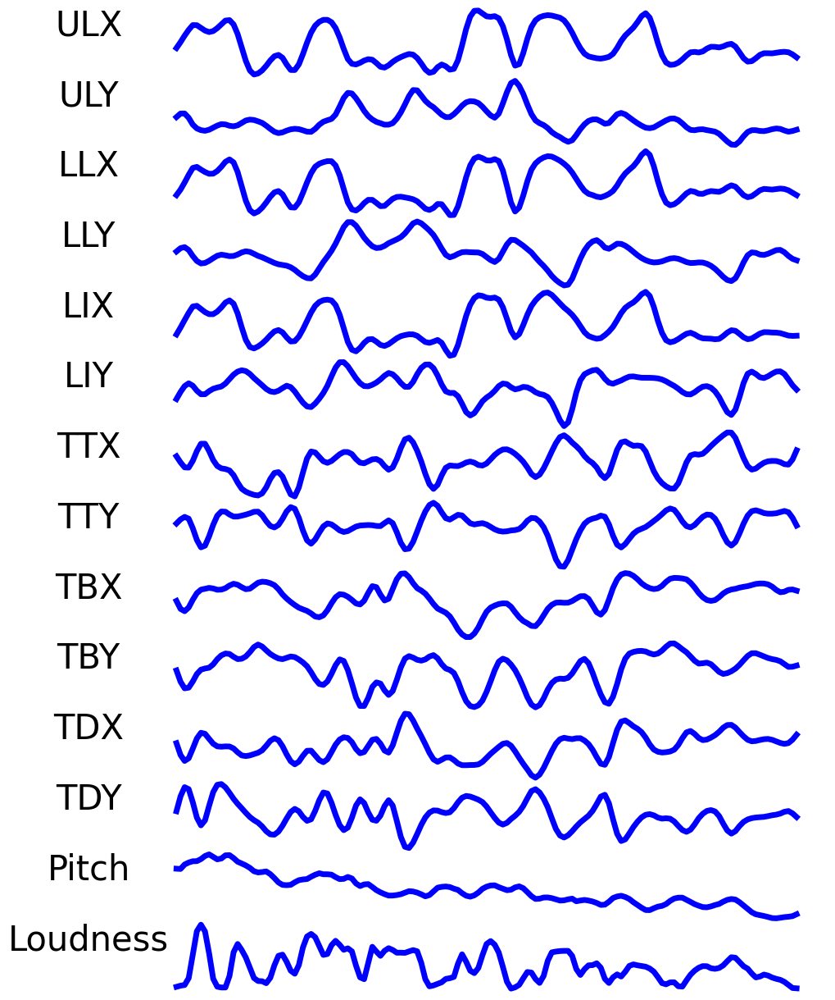
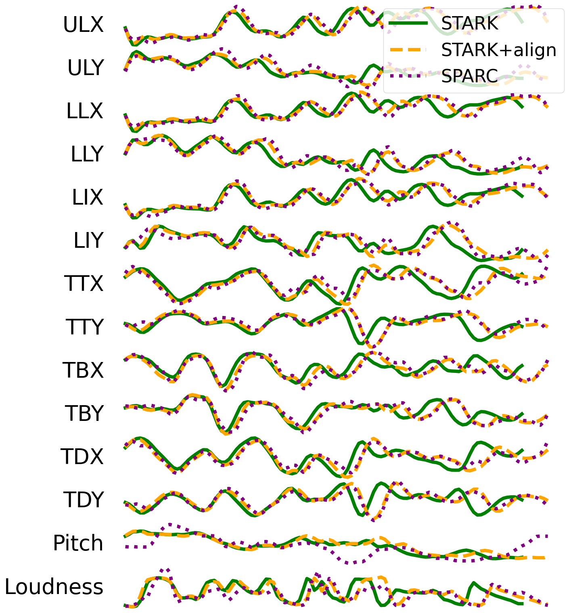

# STArK: Towards Synthesizing Articulatory Kinematics from Text

Official implementation of **STArK**, a non-autoregressive text-to-articulation (TTA) model that
generates articulatory kinematics (EMA + pitch + loudness, in the [SPARC](https://github.com/Berkeley-Speech-Group/Speech-Articulatory-Coding)
feature space) directly from text, and resynthesizes speech from those features via a frozen
SPARC vocoder.

> STArK: Towards Synthesizing Articulatory Kinematics from Text
> Xavier Yin, Carlos Busso — Interspeech 2026
> [Paper (PDF)](https://lab-msp.com/MSP/publications/Yin_2026.pdf) — temporary link, pending official proceedings

Training your own model or reproducing the paper's results from scratch? See
[`TRAINING.md`](TRAINING.md) — this README covers installation and using a trained checkpoint
for inference.

## Installation

Tested on Python 3.11–3.12 (`pyproject.toml` requires `>=3.11,<3.13`).

```bash
uv sync
```

Phonemization uses [Phonemizer](https://github.com/bootphon/phonemizer) with the
[eSpeak NG](https://github.com/espeak-ng/espeak-ng) backend. `uv sync` pulls in
[`espeakng-loader`](https://pypi.org/project/espeakng-loader/), a bundled build of the eSpeak NG
library, so no system-level install or `sudo` access is required — `src/tts/g2p.py` points
Phonemizer at it automatically.

## Inference

[`scripts/stark_cli.py`](scripts/stark_cli.py) is a standalone inference CLI — by default it
downloads the trained checkpoint from the Hugging Face Hub
([`nzxyin/stark-large`](https://huggingface.co/nzxyin/stark-large)), so no local training run or
Hydra config is needed. Pass `--checkpoint` to use a local `.ckpt` instead (e.g. one you trained
yourself, see [`TRAINING.md`](TRAINING.md)).

Text-to-phoneme conversion ([`src/tts/g2p.py`](src/tts/g2p.py)) uses Phonemizer/eSpeak-NG to
reproduce the phoneme convention the model was trained on (word boundaries, stress marks,
punctuation-to-silence-token mapping) — see that module's docstring for details; it's a
best-effort reproduction reverse-engineered from the training data, not guaranteed byte-identical
for every input.

Voice identity isn't something STArK itself conditions on (per the paper, it's speaker-agnostic
by design) — it predicts normalized articulatory kinematics from text, and voice cloning happens
at the SPARC vocoder stage: supply a short reference clip (`--reference-audio`) or a speaker from
the packaged eval set (`--reference-utt-id` + `--dataset-root`, see [`TRAINING.md`](TRAINING.md#data))
to control the output voice.

```bash
# Text-to-speech, cloning a voice from a reference clip
python scripts/stark_cli.py synthesize "Hello, this is a test." \
    --reference-audio my_voice.wav --output out.wav

# Plot the predicted articulatory trajectories for some text
python scripts/stark_cli.py visualize "Hello, this is a test." --output trajectories.png
```

## Example visualizations

Predicted articulatory trajectories (all 12 EMA channels + pitch + loudness) for a single
utterance, as produced by `stark_cli.py visualize`:



STArK's predictions (green) closely track ground-truth SPARC features (purple) across the full
trajectory, with (orange, "STARK+align") and without (green) ground-truth-aligned durations:



## Citation

If you use this code, please cite:

```bibtex
@inproceedings{yin2026stark,
  title     = {{STArK}: Towards Synthesizing Articulatory Kinematics from Text},
  author    = {Yin, Xavier and Busso, Carlos},
  booktitle = {Proc. Interspeech 2026},
  year      = {2026}
}
```

STArK builds directly on SPARC; if you use this code, please also cite the SPARC paper (see
[License](#license) below):

```bibtex
@article{cho2024coding,
  title   = {Coding Speech through Vocal Tract Kinematics},
  author  = {Cho, Cheol Jun and Wu, Peter and Prabhune, Tejas S. and Agarwal, Dhruv and Anumanchipalli, Gopala K.},
  journal = {IEEE Journal of Selected Topics in Signal Processing},
  volume  = {18},
  number  = {8},
  pages   = {1427--1440},
  year    = {2024}
}
```

## License

This repository's original code is MIT-licensed. `src/tts/sparc/` is adapted from the SPARC
codebase (Cho et al., Berkeley Speech Group), used and modified with the original authors'
permission — see [`LICENSE`](LICENSE) for the full terms and citation requirements.
